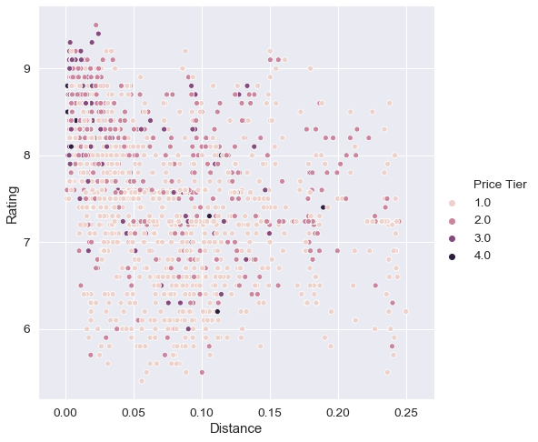

# Predicting Restaurant Ratings in Philadelphia

Capstone project for the **IBM Data Science Professional Certificate** (Coursera, 2021).

Can you predict how well a restaurant is rated using only free, readily available data? This project collects about 1,900 Philadelphia restaurants from the Foursquare API across the city's 48 zip codes, maps where the best-rated food is, and trains classifiers to predict a restaurant's rating tier.



*Restaurants closer to City Hall tend to be rated higher and priced higher.*

## Approach

1. **Data collection.** I pulled zip code boundaries from [OpenDataPhilly](https://www.opendataphilly.org/) and popular restaurants for each zip code from the Foursquare *explore* endpoint. Venue details (rating, price, amenities) came from the *venue details* endpoint. That endpoint is capped at 500 calls per day, so collection was batched over several days and saved to CSV.
2. **Cleaning.** I imputed missing ratings and dropped venues with no price. Venues with missing or invalid zip codes were re-assigned by point-in-polygon lookup with `shapely`. Dozens of Yes/No amenity fields were encoded as binary features, and I added a feature for distance from City Hall.
3. **Exploration.** I used correlation heatmaps, rating distributions by price tier and category, and interactive `folium` maps of restaurant density, rating and price by zip code.
4. **Modelling.**
   - K-means clustering to segment venues.
   - Ratings were binned into four ordinal classes (low → high).
   - I compared four classifiers: SVM, decision tree, logistic regression and ridge classifier.

## Results

| Model | Accuracy | F1 (weighted) | Jaccard |
|---|---|---|---|
| **Logistic regression** | **0.771** | 0.745 | **0.620** |
| Decision tree (depth 3) | 0.749 | **0.749** | 0.610 |
| SVM (RBF kernel) | 0.703 | 0.716 | 0.567 |
| Ridge classifier | 0.667 | 0.686 | 0.534 |

- Price tier, alcohol service and proximity to Center City are the strongest signals for a high rating.
- Center City and South Philly have the densest clusters of highly rated restaurants.
- Simple linear and shallow tree models perform as well as more complex ones on this small feature set.

## Repository structure

```
├── notebooks/Capstone_Final.ipynb   # full analysis: collection → cleaning → EDA → models
├── data/                            # Foursquare extracts and Philadelphia zip code polygons
├── maps/                            # interactive folium maps (download and open in a browser)
├── reports/                         # written report and slide deck (PDF)
└── images/                          # figures used in this README
```

- The complete write-up is in [reports/Capstone_Report.pdf](reports/Capstone_Report.pdf).
- A summary deck is in [reports/CourseraCapstone_presentation.pdf](reports/CourseraCapstone_presentation.pdf).

## Running it

```bash
pip install -r requirements.txt
jupyter notebook notebooks/Capstone_Final.ipynb
```

All API results are saved in `data/`, so you don't need Foursquare credentials to run the analysis. The API calls are commented out.

The notebook was originally written in 2021 with Python 3.7. A few imports (e.g. `pandas.io.json.json_normalize`, `sklearn.externals.six`) have since moved in newer library versions.

## Tools

Python · pandas · NumPy · scikit-learn · folium · shapely · geopy · matplotlib · seaborn · Foursquare API
